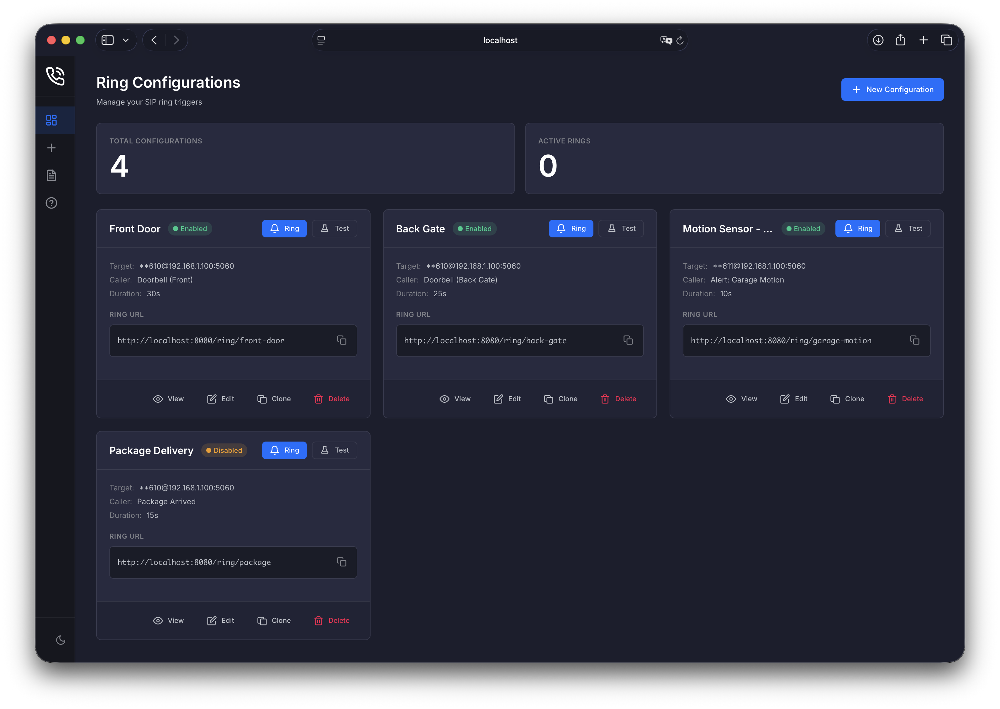

# SIPring

A Docker-based SIP phone ringing service for triggering alerts via HTTP requests. Perfect for doorbell notifications, alert systems, or any scenario where you want to ring a SIP phone programmatically.

[](https://ko-fi.com/V7V31T6CL9)



## Features

- **Simple HTTP API** - Trigger rings with a single GET request
- **Web Dashboard** - Manage configurations through a modern dark/light theme interface
- **Multiple Configurations** - Set up different ring profiles for various scenarios
- **Event Log** - Track every ring with metadata, filterable by config, time range, and result
- **Caller ID Support** - Display custom caller names on the phone
- **Overlap Behavior** - Configure per-config behavior when triggered while already ringing (ignore, extend, or replace)
- **Cancellation** - Stop ringing before timeout or if answered
- **Docker Ready** - Easy deployment with Docker Compose

## Quick Start

### Using Docker (Recommended)

```bash
git clone https://github.com/jordiboehme/sipring.git
cd sipring/docker
docker compose up -d
```

The web interface will be available at `http://localhost:8080`

> **Note**: Docker must use host networking (`network_mode: host`) for SIP UDP to work correctly.

### Manual Installation

```bash
git clone https://github.com/jordiboehme/sipring.git
cd sipring
pip install -e .
uvicorn sipring.main:app --host 0.0.0.0 --port 8080
```

## Usage

### Web Interface

1. Open `http://localhost:8080` in your browser
2. Click "New Configuration" to create a ring profile
3. Enter your SIP phone details:
   - **Name**: Display name for the configuration
   - **SIP User**: The extension/user to call (e.g., `100` or `**610`)
   - **SIP Server**: Your PBX/phone IP address
   - **Caller Name**: What appears on the phone when ringing
4. Click "Test" to verify it works
5. Copy the Ring URL and use it in your automation

### API

```bash
# Trigger a ring
curl http://localhost:8080/ring/doorbell

# Trigger with custom duration (seconds)
curl "http://localhost:8080/ring/doorbell?duration=10"

# Cancel an active ring
curl http://localhost:8080/ring/doorbell/cancel

# Check ring status
curl http://localhost:8080/ring/doorbell/status
```

### Configuration Management

```bash
# List all configurations
curl http://localhost:8080/api/configs

# Create a new configuration
curl -X POST http://localhost:8080/api/configs \
  -H "Content-Type: application/json" \
  -d '{
    "name": "Front Door",
    "sip_user": "100",
    "sip_server": "192.168.1.10",
    "caller_name": "Doorbell"
  }'

# Update a configuration
curl -X PUT http://localhost:8080/api/configs/front-door \
  -H "Content-Type: application/json" \
  -d '{"ring_duration": 60}'

# Delete a configuration
curl -X DELETE http://localhost:8080/api/configs/front-door
```

## Configuration Options

### Ring Configuration Fields

| Field           | Required | Default  | Description                                        |
| --------------- | -------- | -------- | -------------------------------------------------- |
| `name`          | Yes      | -        | Display name for the configuration                 |
| `slug`          | No       | auto     | URL-friendly identifier (auto-generated from name) |
| `sip_user`      | Yes      | -        | SIP user/extension to call                         |
| `sip_server`    | Yes      | -        | SIP server hostname or IP                          |
| `sip_port`      | No       | 5060     | SIP server port                                    |
| `caller_name`   | Yes      | -        | Caller ID display name                             |
| `caller_user`   | No       | 107      | Caller SIP user (numeric recommended)              |
| `ring_duration`    | No       | 30       | Maximum ring duration in seconds                              |
| `overlap_behavior` | No       | ignore   | What to do when triggered while already ringing: `ignore`, `extend`, `replace` |
| `local_port`       | No       | 5062     | Local UDP port for SIP                                        |
| `enabled`          | No       | true     | Whether this config is active                                 |

### Environment Variables

| Variable            | Default | Description                                                          |
| ------------------- | ------- | -------------------------------------------------------------------- |
| `SIPRING_DATA_DIR`  | `/data` | Directory for storing configuration                                  |
| `SIPRING_PORT`      | `8080`  | HTTP server port                                                     |
| `SIPRING_BASE_URL`  | -       | External URL for reverse proxy (e.g., `https://sipring.example.com`) |
| `SIPRING_SIP_HOST`  | -       | External IP/hostname for SIP headers (for NAT/proxy setups)          |
| `SIPRING_LOG_LEVEL` | `INFO`  | Log level (DEBUG, INFO, WARNING, ERROR)                              |
| `SIPRING_USERNAME`  | -       | Basic auth username (optional)                                       |
| `SIPRING_PASSWORD`  | -       | Basic auth password (optional)                                       |
| `SIPRING_EVENT_RETENTION_DAYS` | `90` | Days to keep event history (0 = keep forever)             |

## Integration Examples

### Home Assistant

```yaml
# configuration.yaml
rest_command:
  ring_doorbell:
    url: "http://sipring:8080/ring/doorbell"
    method: GET

# automations.yaml
- alias: "Ring phone when doorbell pressed"
  trigger:
    - platform: state
      entity_id: binary_sensor.doorbell
      to: "on"
  action:
    - service: rest_command.ring_doorbell
```

### Node-RED

Use an HTTP Request node with:

- Method: GET
- URL: `http://sipring:8080/ring/doorbell`

### Webhooks

Simply use the ring URL as a webhook endpoint in any service that supports HTTP webhooks (IFTTT, Zapier, etc.)

## Tested Hardware

- **Gigaset N670 IP Pro DECT** - Works without SIP authentication on LAN

The service should work with any SIP phone/PBX that accepts standard SIP INVITE messages. Authentication is not currently implemented but can be added if needed.

## API Documentation

Full API documentation is available at `http://localhost:8080/docs` (Swagger UI) or `http://localhost:8080/redoc` (ReDoc).

## Development

### Running Tests

```bash
pip install -e ".[dev]"
pytest tests/ -v
```

### Project Structure

```
sipring/
├── sipring/
│   ├── main.py          # FastAPI application
│   ├── config.py        # Settings
│   ├── models.py        # Pydantic models
│   ├── storage.py       # JSON file storage
│   ├── ring_manager.py  # Active call management
│   ├── sip/             # SIP protocol implementation
│   ├── api/             # API endpoints
│   └── templates/       # Web UI templates
├── docker/
│   ├── Dockerfile
│   └── docker-compose.yml
└── tests/
```

## Troubleshooting

### Phone doesn't ring

1. Check that the SIP server IP is correct and reachable
2. Verify the SIP user/extension exists
3. Check firewall rules allow UDP on the local port (default 5062)

### Caller ID not showing

Some phones require specific headers. The default configuration includes `P-Asserted-Identity` and `Remote-Party-ID` headers which work with most phones.

### Docker networking issues

SIP requires the source IP to match what the phone sees. Use `network_mode: host` in Docker, or ensure proper NAT handling if using bridge networking.

## License

MIT License - See [LICENSE](LICENSE) for details.
